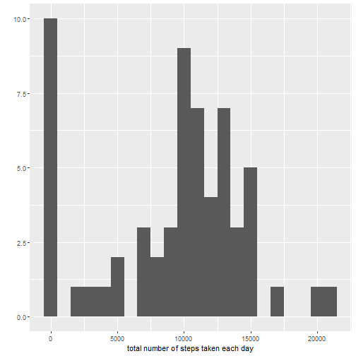
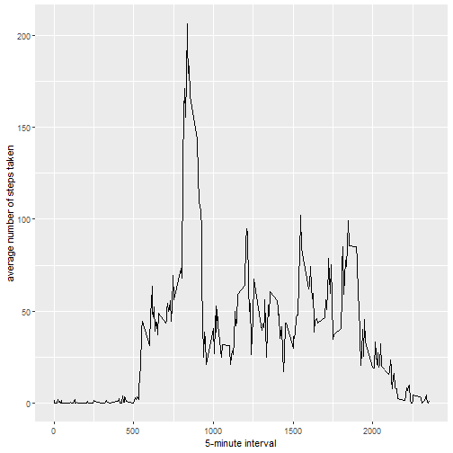
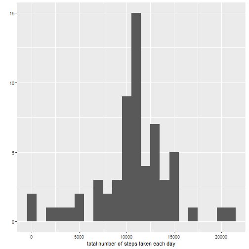
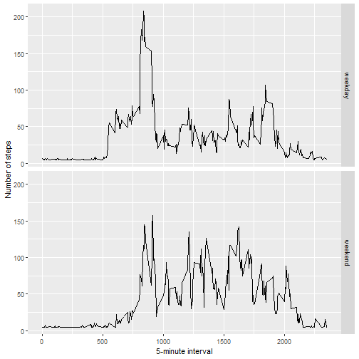

#Reproducible Research Course Project

```r
knitr::opts_chunk$set(echo=TRUE)
```


## Adding the required libraries

```r
library(ggplot2)
```

## Loading and exploring the dataset

```r
activity_data <- read.csv("activity.csv")
summary(activity_data)
```

```
##      steps            date              interval     
##  Min.   :  0.00   Length:17568       Min.   :   0.0  
##  1st Qu.:  0.00   Class :character   1st Qu.: 588.8  
##  Median :  0.00   Mode  :character   Median :1177.5  
##  Mean   : 37.38                      Mean   :1177.5  
##  3rd Qu.: 12.00                      3rd Qu.:1766.2  
##  Max.   :806.00                      Max.   :2355.0  
##  NA's   :2304
```

```r
str(activity_data)
```

```
## 'data.frame':	17568 obs. of  3 variables:
##  $ steps   : int  NA NA NA NA NA NA NA NA NA NA ...
##  $ date    : chr  "2012-10-01" "2012-10-01" "2012-10-01" "2012-10-01" ...
##  $ interval: int  0 5 10 15 20 25 30 35 40 45 ...
```

## Calculating the mean total number of steps taken per day

```r
total_steps <- tapply(activity_data$steps,activity_data$date,sum,na.rm=TRUE)
qplot(total_steps,binwidth=1000,xlab="total number of steps taken each day")
```



## Making Time Series Plot of  average daily activity pattern

```r
data_avg <- aggregate(x=list(avg_steps=activity_data$steps), by=list(step_interval=activity_data$interval), 
                      FUN=mean, na.rm=TRUE)
ggplot(data=data_avg, aes(x=step_interval, y=avg_steps)) +
  geom_line() +
  xlab("5-minute interval") +
  ylab("average number of steps taken")
```



## Calculating the max 5-minute interval

```r
max_steps <- data_avg$step_interval[which.max(data_avg$avg_steps)]
max_steps
```

```
## [1] 835
```

## Calculating the missing values

```r
colSums(is.na(activity_data))
```

```
##    steps     date interval 
##     2304        0        0
```

## Imputing the missing values with mean 

```r
activity_data$steps[is.na(activity_data$steps)] <- mean(activity_data$steps, na.rm = TRUE)
activity_new_data <- activity_data
```

## Creating histogram after imputing missing values

```r
total_new_steps <- tapply(activity_new_data$steps,activity_new_data$date,sum,na.rm=TRUE)
qplot(total_new_steps,binwidth=1000,xlab="total number of steps taken each day")
```



## Calculating mean and median after imputing the missing values

```r
mean(total_new_steps,na.rm = TRUE)
```

```
## [1] 10766.19
```

```r
median(total_new_steps,na.rm = TRUE)
```

```
## [1] 10766.19
```

## Mean and median values are higher after imputing the missing data as now the missing values were filled with mean of the steps for the associated interval

## Creating a factor variable which identifies a day as either a weekday or weekend

```r
day_type <- function(date) {
  day <- weekdays(date)
  if (day %in% c("Monday", "Tuesday", "Wednesday", "Thursday", "Friday"))
    return("weekday")
  else if (day %in% c("Saturday", "Sunday"))
    return("weekend")
  else
    stop("invalid date")
}

activity_new_data$date <- as.Date(activity_new_data$date)
activity_new_data$day <- sapply(activity_new_data$date, FUN=day_type)
table(activity_new_data$day)
```

```
## 
## weekday weekend 
##   12960    4608
```

## Making a panel plot containing average number of steps on weekday and weekend

```r
averages_new_data <- aggregate(steps ~ interval + day, data=activity_new_data, mean)
ggplot(averages_new_data, aes(interval, steps)) + geom_line() + facet_grid(day ~ .) +
  xlab("5-minute interval") + ylab("Number of steps")
```




